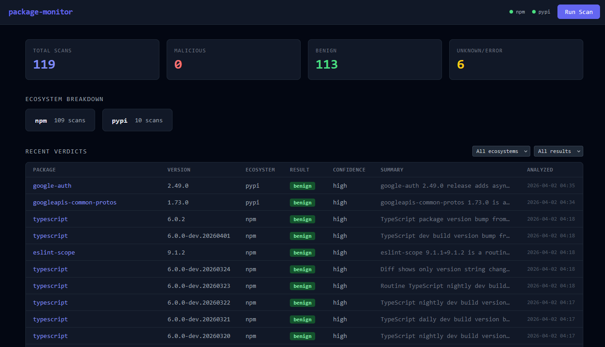
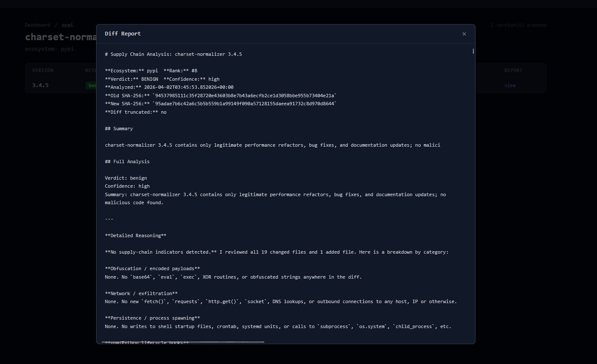

# package-monitor

Supply chain security monitor for npm and PyPI packages. Watches the top-N
most-downloaded packages for new releases, downloads old and new tarballs,
generates unified diffs, analyzes them with
[opencode](https://opencode.ai) for signs of compromise, and persists results
to SQLite. Alerts are written as local Markdown reports and optionally posted
to Twitter/X or Slack.

## Requirements

- Python ≥ 3.11
- [uv](https://docs.astral.sh/uv/) package manager
- [opencode](https://opencode.ai) v1.3.13+ installed and authenticated
- (Optional) Twitter API credentials for tweet notifications
- (Optional) Slack incoming webhook URL for Slack notifications

## Installation

```bash
git clone <repo>
cd package-monitor
uv sync
```

For development (includes pytest + pytest-mock):

```bash
uv sync --extra dev
```

---

## Screenshots

### Web Dashboard



The dashboard provides a live view of all analyzed releases with filtering by ecosystem and verdict status.

### Analysis Report



Each release generates a detailed Markdown report with the AI analysis results and any detected anomalies.

---

## CLI — Monitor

### One-shot poll (top 10 packages, both ecosystems)

```bash
uv run package-monitor --once --top 10
```

### Continuous monitoring (poll every 5 minutes, top 1000)

```bash
uv run package-monitor --top 1000 --interval 300
```

### npm only or PyPI only

```bash
uv run package-monitor --once --ecosystem npm  --top 50
uv run package-monitor --once --ecosystem pypi --top 50
```

### With Twitter notifications

```bash
export TWITTER_API_KEY=...
export TWITTER_API_SECRET=...
export TWITTER_ACCESS_TOKEN=...
export TWITTER_ACCESS_TOKEN_SECRET=...

uv run package-monitor --once --notifiers local,twitter --top 10
```

### With Slack notifications

```bash
export SLACK_WEBHOOK_URL=https://hooks.slack.com/services/...

uv run package-monitor --once --notifiers local,slack --top 10
```

### Monitor CLI flags

| Flag | Default | Description |
|------|---------|-------------|
| `--top N` | 1000 | Number of top packages to watch per ecosystem |
| `--interval S` | 300 | Seconds between polls (ignored with `--once`) |
| `--once` | off | Run one poll cycle and exit |
| `--db PATH` | `scm.db` | SQLite database path |
| `--notifiers LIST` | `local` | Comma-separated notifier names |
| `--workers N` | 4 | Parallel release-processing threads |
| `--analyze-timeout S` | 300 | Per-release opencode timeout in seconds |
| `--ecosystem NAME` | both | Collector ecosystem to use (`npm`, `pypi`, or both) |
| `--log-level` | `INFO` | Logging verbosity (`DEBUG`, `INFO`, `WARNING`, `ERROR`) |

---

## CLI — Cron job (monitor)

Install the monitor as a recurring cron job so it runs automatically:

```bash
# Every 5 minutes, top 1000 packages, local notifier
uv run package-monitor-install-cron --schedule "*/5 * * * *" --top 1000

# With extra options
uv run package-monitor-install-cron \
    --schedule "*/5 * * * *" \
    --top 1000 \
    --notifiers local,slack \
    --workers 8

# Remove the cron entry
uv run package-monitor-uninstall-cron
```

Output is appended to `$HOME/package-monitor.log`.

### Cron install flags

| Flag | Default | Description |
|------|---------|-------------|
| `--schedule CRON` | `*/5 * * * *` | Cron schedule expression |
| `--db PATH` | — | Embed `--db PATH` in the cron command |
| `--top N` | — | Embed `--top N` in the cron command |
| `--notifiers LIST` | — | Embed `--notifiers LIST` in the cron command |
| `--workers N` | — | Embed `--workers N` in the cron command |

---

## Web Dashboard

```bash
# Start on all interfaces, port 5000
uv run package-monitor-dashboard --db scm.db

# Custom port and log level
uv run package-monitor-dashboard --db scm.db --port 8080 --log-level DEBUG

# Bind to localhost only (development)
uv run package-monitor-dashboard --db scm.db --host 127.0.0.1
```

Open `http://<host>:5000` in a browser.

The dashboard provides:
- Live verdict feed with ecosystem/result filters
- Per-package release history
- **Scan page** — trigger on-demand scans, force-scan a specific
  package@version, reset collector state, install/remove cron jobs, view scan
  history and a live log pane

### Dashboard CLI flags

| Flag | Default | Description |
|------|---------|-------------|
| `--db PATH` | `scm.db` | SQLite database path |
| `--port N` | `5000` | HTTP port |
| `--host ADDR` | `0.0.0.0` | Bind address (`0.0.0.0` = all interfaces) |
| `--debug` | off | Enable Flask debug/reloader |
| `--binaries-dir PATH` | project root/binaries | Override binaries directory |
| `--reports-dir PATH` | project root/reports | Override reports directory |
| `--log-level` | `INFO` | Logging verbosity |

### Dashboard API

All endpoints accept and return JSON.

| Method | Path | Description |
|--------|------|-------------|
| `GET` | `/api/scan/status` | Current scan status and live log |
| `POST` | `/api/scan/start` | Start a scan (`ecosystems`, `notifiers`, `top_n`, `workers`, `analyze_timeout`) |
| `POST` | `/api/scan/reset` | Reset collector state (`ecosystems`) for fresh 30-day lookback |
| `GET` | `/api/scan/history` | Past scan summaries (newest first, capped at 20) |
| `POST` | `/api/scan/force` | Force-scan one package (`ecosystem`, `package`, `version`) |
| `GET` | `/api/cron/status` | Cron installation status for monitor and dashboard |
| `POST` | `/api/cron/install` | Install a cron entry (`type`: `"monitor"` or `"dashboard"`, plus options) |
| `POST` | `/api/cron/uninstall` | Remove a cron entry (`type`: `"monitor"` or `"dashboard"`) |
| `GET` | `/report?path=…` | Serve a local report file (must be under `reports/`) |

---

## Running the Dashboard Permanently

Use the built-in service installer to register the dashboard as an `@reboot`
cron entry. It starts automatically on every machine login or reboot.

### Install via CLI

```bash
# Install with defaults (@reboot, port 5000, 0.0.0.0)
uv run package-monitor-dashboard-install-service

# Custom port and schedule
uv run package-monitor-dashboard-install-service \
    --schedule "@reboot" \
    --port 8080 \
    --db /home/user/scm.db

# Remove the service entry
uv run package-monitor-dashboard-uninstall-service
```

Output is appended to `$HOME/package-monitor-dashboard.log`.

### Install via the web UI

Navigate to **Run Scan → Cron & Service Management** in the dashboard.
The "Dashboard service" card shows the current installation status and lets
you install or remove the `@reboot` entry without touching the terminal.

### Service installer flags

| Flag | Default | Description |
|------|---------|-------------|
| `--schedule CRON` | `@reboot` | Cron schedule (use `@reboot` for service behaviour) |
| `--db PATH` | — | Embed `--db PATH` in the dashboard command |
| `--port N` | — | Embed `--port N` in the dashboard command |
| `--host ADDR` | — | Override bind address (default already `0.0.0.0`) |
| `--log-level LEVEL` | — | Embed `--log-level LEVEL` in the dashboard command |

> **Note:** `@reboot` runs once per login session on macOS. On Linux servers
> it runs once per boot. Both behaviours are correct for a persistent service.

---

## Plugin System

New collectors and notifiers self-register via `importlib.metadata` entry
points — no changes to this repository required.

### Add a collector

```toml
# In your package's pyproject.toml:
[project.entry-points."package_monitor.collectors"]
myecosystem = "mypkg.collector:MyCollector"
```

### Add a notifier

```toml
[project.entry-points."package_monitor.notifiers"]
mychannel = "mypkg.notifier:MyNotifier"
```

See `AGENTS.md` for full implementation stubs and the interface contracts.

---

## Environment Variables

| Variable | Required for |
|----------|-------------|
| `TWITTER_API_KEY` | Twitter notifier |
| `TWITTER_API_SECRET` | Twitter notifier |
| `TWITTER_ACCESS_TOKEN` | Twitter notifier |
| `TWITTER_ACCESS_TOKEN_SECRET` | Twitter notifier |
| `SLACK_WEBHOOK_URL` | Slack notifier |

Export these directly or copy `.env.example` to `.env` and fill in the values.

---

## Architecture

```
package-monitor (CLI / dashboard scan)
    └── orchestrator.run_multi()
            ├── NpmCollector.poll()   ──────────────────┐
            ├── PypiCollector.poll()  ────────────────┐ │
            │                                         │ │  (parallel threads)
            └── per-release pipeline ←────────────────┘─┘
                    ├── collector.get_previous_version()
                    ├── storage.download_tarball()     →  binaries/
                    ├── differ.diff_release()          →  unified diff
                    ├── analyzer.analyze()             →  opencode subprocess → Verdict
                    └── notifier.notify()              →  local / twitter / slack
```

All state is persisted in SQLite (`scm.db` by default). Tarballs are written
to `binaries/<ecosystem>/<package>/<version>/` and are **never deleted** —
re-runs reuse the cache. Reports are written to
`reports/<ecosystem>/<package>/<version>.md`.

---

## Running Tests

```bash
uv run pytest -v
```

275 tests, no network calls, no real subprocess invocations.

---

## Development Tools

Code quality and analysis commands for development and code review.

### Lint (ruff)

Run the linter and format checker on the codebase:

```bash
# Check src and tests for linting and formatting issues
uv run package-monitor-lint

# Auto-fix issues where possible
uv run package-monitor-lint --fix

# Check specific paths
uv run package-monitor-lint src/scm/collectors
```

### Type Check (pyright)

Run static type analysis:

```bash
# Type check src/
uv run package-monitor-typecheck

# Enable strict mode
uv run package-monitor-typecheck --strict

# Check specific paths
uv run package-monitor-typecheck src/scm/analyzer.py
```

### Complexity Analysis (radon)

Analyze cyclomatic complexity of the codebase:

```bash
# Show functions with rank C or worse (default)
uv run package-monitor-complex

# Show average complexity per file
uv run package-monitor-complex --average

# Show all functions regardless of rank
uv run package-monitor-complex --show-all

# Only show ranks D and worse
uv run package-monitor-complex --min-rank D
```

Complexity rankings: A (best) → F (worst)

### Dependency Graph (pydeps)

Generate module dependency graphs for AI consumption:

```bash
# Generate JSON graph of src/scm dependencies (default)
uv run package-monitor-graph --format json

# Text output format
uv run package-monitor-graph --format text

# Save to file
uv run package-monitor-graph --format json -o deps.json

# Include more hops (0 = infinite)
uv run package-monitor-graph --max-bacon 3 --format json

# Exclude external dependencies
uv run package-monitor-graph --no-externals --format json
```

The graph output shows:
- Module import relationships (`imports` / `imported_by`)
- Distance from root (`bacon` score)
- File paths for each module

---

## Troubleshooting

### `uv sync` fails with `ModuleNotFoundError: No module named 'setuptools.backends'`

The build backend in `pyproject.toml` is wrong. It must be:

```toml
[build-system]
build-backend = "setuptools.build_meta"
```

Not `setuptools.backends.legacy:build`.

### Dashboard shows no releases after a scan

The collector state may be stale. Reset it via the dashboard:

1. Go to **Run Scan → Reset collector state**
2. Click **Reset all**
3. Start a new scan

Or via the CLI:

```bash
sqlite3 scm.db "DELETE FROM collector_state;"
```

### `crontab binary not found` error

`cron` is not installed. On Debian/Ubuntu:

```bash
sudo apt-get install cron
sudo systemctl enable cron
```

On macOS, crontab is available by default but may require Full Disk Access
in System Settings → Privacy & Security.

### Dashboard is not accessible from other machines

The default bind address is `0.0.0.0` (all interfaces). Check:

1. The process is running: `ps aux | grep package-monitor-dashboard`
2. The port is not blocked by a firewall
3. You are using the correct IP and port

### `@reboot` cron entry installed but dashboard doesn't start on reboot

Check `$HOME/package-monitor-dashboard.log` for errors. Common causes:

- `package-monitor-dashboard` not on `PATH` for the cron environment —
  use the full path: `which package-monitor-dashboard` and pass it explicitly
  via `--schedule @reboot` with the full binary path embedded in the cron line
- The `scm.db` path is relative — always use an absolute path with `--db`

```bash
uv run package-monitor-dashboard-install-service \
    --db /home/user/package-monitor/scm.db \
    --port 5000
```

### Force-scanning a package returns 409

A scan is already running. Wait for it to finish or check
`/api/scan/status`. If the scan is stuck, restart the dashboard process.

### opencode analysis times out

The default timeout is 300 seconds per release. Increase it:

```bash
uv run package-monitor --once --analyze-timeout 600 --top 10
```

Or via the dashboard scan form → **Timeout (s)** field.
